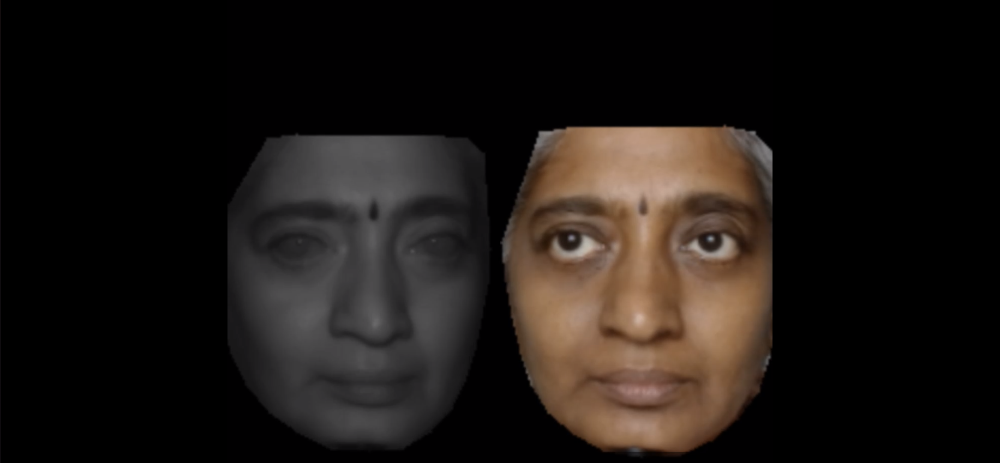

   

# CycleGAN and pix2pix in PyTorch

We provide PyTorch implementations for both paired frame-to-frame (pix2pix and supervised cyclegan) and paired frame sequence-to-frame sequence (supervised cyclegan) translation for 10bit NIR pgm files to 8 bit RGB png files for follow on rPPG extraction.

The code was adapted from the source by [Jun-Yan Zhu](https://github.com/junyanz) and [Taesung Park](https://github.com/taesungp)

Sample train and test data is shared in https://1drv.ms/u/s!AnqZUd2JCwTBlYEgN3tduR3Frid2hA?e=nY5wHN

**Note**: The current software works well with PyTorch 1.13.1. 

**CycleGAN: [Project](https://junyanz.github.io/CycleGAN/) |  [Paper](https://arxiv.org/pdf/1703.10593.pdf) |  [Torch](https://github.com/junyanz/CycleGAN) |
[Tensorflow Core Tutorial](https://www.tensorflow.org/tutorials/generative/cyclegan) | [PyTorch Colab](https://colab.research.google.com/github/junyanz/pytorch-CycleGAN-and-pix2pix/blob/master/CycleGAN.ipynb)**

**Pix2pix:  [Project](https://phillipi.github.io/pix2pix/) |  [Paper](https://arxiv.org/pdf/1611.07004.pdf) |  [Torch](https://github.com/phillipi/pix2pix) |
[Tensorflow Core Tutorial](https://www.tensorflow.org/tutorials/generative/pix2pix) | [PyTorch Colab](https://colab.research.google.com/github/junyanz/pytorch-CycleGAN-and-pix2pix/blob/master/pix2pix.ipynb)**

If you use this code for your research, please cite:

Unpaired Image-to-Image Translation using Cycle-Consistent Adversarial Networks. 
[Jun-Yan Zhu](https://www.cs.cmu.edu/~junyanz/)\*,  [Taesung Park](https://taesung.me/)\*, [Phillip Isola](https://people.eecs.berkeley.edu/~isola/), [Alexei A. Efros](https://people.eecs.berkeley.edu/~efros). In ICCV 2017. (* equal contributions) [[Bibtex]](https://junyanz.github.io/CycleGAN/CycleGAN.txt)

Image-to-Image Translation with Conditional Adversarial Networks. 
[Phillip Isola](https://people.eecs.berkeley.edu/~isola), [Jun-Yan Zhu](https://www.cs.cmu.edu/~junyanz/), [Tinghui Zhou](https://people.eecs.berkeley.edu/~tinghuiz), [Alexei A. Efros](https://people.eecs.berkeley.edu/~efros). In CVPR 2017. [[Bibtex]](https://www.cs.cmu.edu/~junyanz/projects/pix2pix/pix2pix.bib)

